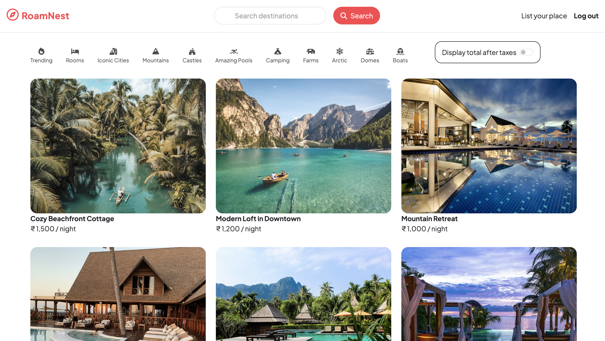
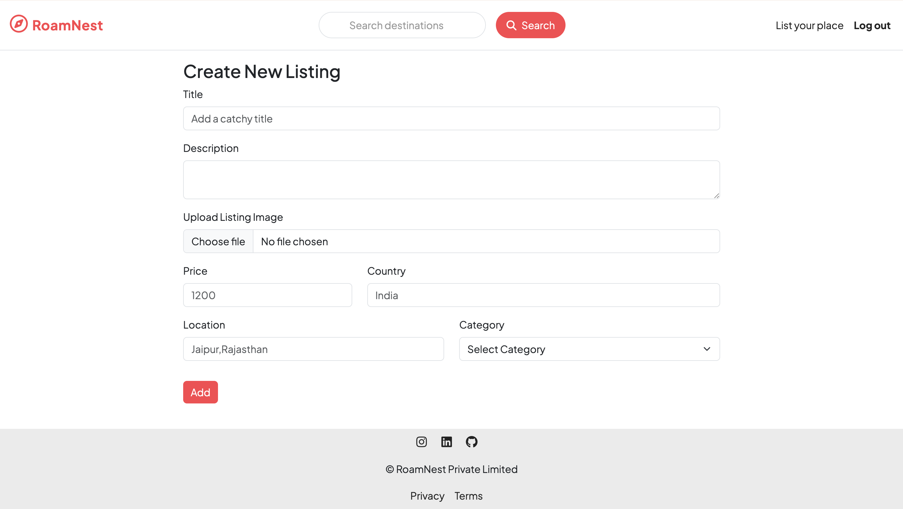
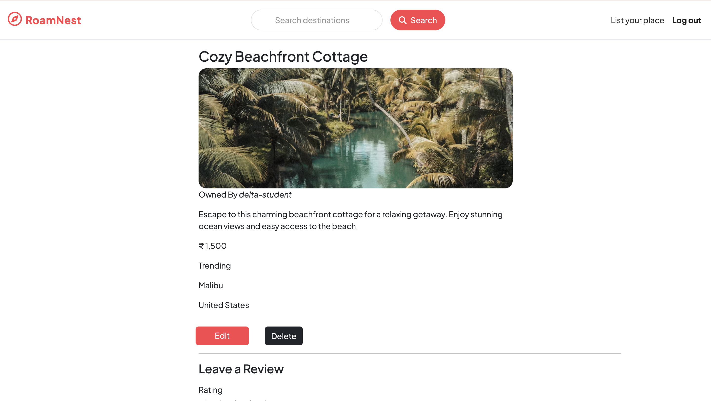
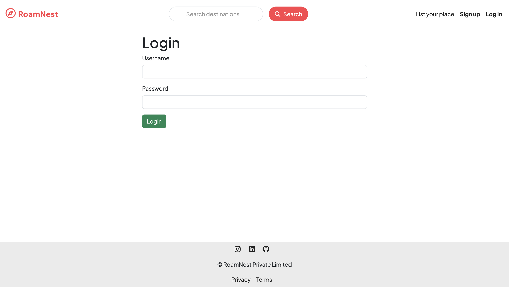
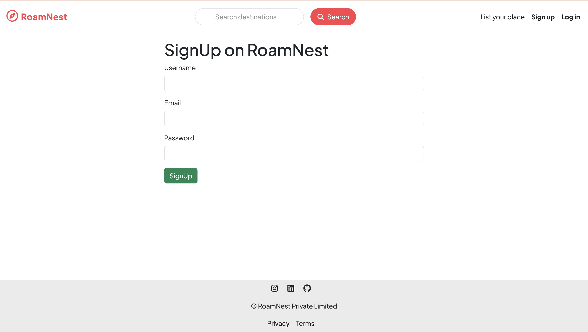

# 🏡 RoamNest – Full Stack Travel Listing Platform

RoamNest is a **full-stack travel listing web application** inspired by Airbnb.  
It allows users to explore destinations, create property listings, write reviews, and manage their own content securely.

This project is developed as a **Major Full Stack Project** to demonstrate real-world backend + frontend integration using **Node.js, Express, MongoDB, and MVC architecture**.

---

## 🚀 Live Demo
👉 https://roamnest.onrender.com

## 📂 GitHub Repository
👉 https://github.com/prachi757/RoamNest

---

## 🚀 Features Overview

### 👤 User Authentication & Authorization
- Secure user signup and login using **Passport.js**
- Password hashing and session-based authentication
- Authorization middleware to protect routes
- Only logged-in users can:
  - Create listings
  - Add reviews
- Only owners can:
  - Edit or delete their own listings
  - Delete their own reviews

---

### 🏘️ Travel Listings
- Create, edit, and delete property listings
- Each listing includes:
  - Title
  - Description
  - Price
  - Location
  - Country
  - Category
  - Image upload
- Image handling via **Cloudinary**
- View:
  - All listings
  - Individual listing detail pages

---

### ⭐ Reviews & Ratings
- Logged-in users can add reviews
- Star-based rating system
- Review deletion restricted to the review owner
- Reviews linked to both listing and user

---

### 🛡️ Security & Validation
- **Joi** for server-side schema validation
- Centralized error handling using `ExpressError`
- Async error handling using `wrapAsync`
- Middleware-based access control
- Secure environment variables using `.env`

---

### 🎨 User Interface
- Server-side rendering using **EJS**
- Centralized layout management using **EJS Boilerplate**
- Clean and responsive UI using **Bootstrap**
- Reusable UI components:
  - Navbar
  - Footer
- Flash messages for success and error feedback

---

## 🛠️ Tech Stack

### Frontend
- HTML5  
- CSS3  
- Bootstrap  
- EJS (Embedded JavaScript Templates)

### Backend
- Node.js  
- Express.js  
- MongoDB  
- Mongoose  
- Passport.js  

### Tools & Services
- MongoDB Atlas  
- Cloudinary (image storage)  
- Render (deployment)  
- Git & GitHub  

---

## 📸 Screenshots

### 🏠 Home Page


### 🏘️  Add New Listing Page


### 📄 Listing Detail Page


### 🔐 Login Page


### 📝 Signup Page


---

## 📁 Project Structure

```text
MAJORPROJECT/
│
├── controllers/
│   ├── listings.js
│   ├── reviews.js
│   └── users.js
│
├── init/
│   ├── data.js
│   └── index.js
│
├── models/
│   ├── listing.js
│   ├── review.js
│   └── user.js
│
├── routes/
│   ├── listings.js
│   ├── review.js
│   └── user.js
│
├── views/
│   ├── includes/
│   │   ├── navbar.ejs
│   │   └── footer.ejs
│   │
│   ├── layouts/
│   │   └── boilerplate.ejs
│   │
│   ├── listings/
│   │   ├── index.ejs
│   │   ├── show.ejs
│   │   ├── new.ejs
│   │   └── edit.ejs
│   │
│   ├── users/
│   │   ├── signup.ejs
│   │   └── login.ejs
│   │
│   └── static/
│       ├── privacy.ejs
│       └── terms.ejs
│
├── public/
│   ├── css/
│   │   └── style.css
│   └── js/
│       └── map.js
│
├── utils/
│   ├── ExpressError.js
│   └── wrapAsync.js
│
├── middleware.js
├── schema.js
├── app.js
├── cloudConfig.js
├── .env
├── package.json
└── README.md
```

---

## ⚙️ Installation & Setup (Local Machine)

Follow the steps below to run **RoamNest – Full Stack Travel Listing Platform** on your local machine.

---

### 1️⃣ Clone the Repository

```bash
git clone https://github.com/prachi757/RoamNest.git
cd MAJORPROJECT

### 2️⃣ Install Dependencies

```bash
npm install

### 3️⃣ Environment Variables Setup

Create a `.env` file in the root directory and add the following variables:

```env
CLOUD_NAME=your_cloudinary_cloud_name
CLOUD_API_KEY=your_cloudinary_api_key
CLOUD_API_SECRET=your_cloudinary_api_secret
ATLASDB_URL=your_mongodb_atlas_connection_url
SECRET=your_session_secret

📌 Notes

These environment variables are required for:
- Cloudinary image upload
- MongoDB Atlas database connection
- Session & authentication security

Make sure `.env` is added to `.gitignore`

⚠️ Never push your `.env` file to GitHub

---

### 4️⃣ Run the Application

```bash
node app.js
```

or (recommended during development):

```bash
nodemon app.js
```

---

### 5️⃣ Open in Browser

```text
http://localhost:8080/listings
```

---

## 📚 Learning Outcomes

- Practical implementation of MVC architecture  
- Authentication & authorization using Passport.js  
- MongoDB schema design and relationships  
- Middleware usage for validation and security  
- Environment variable based production deployment  
- Real-world backend workflow  

---

## 🚀 Future Enhancements

- Booking & reservation system  
- Payment gateway integration  
- Advanced search & filters  
- User profile dashboard  
- Admin panel  

---

## 👩‍💻 Author

**Prachi Garg**  
- GitHub: https://github.com/prachi757  
- LinkedIn: https://www.linkedin.com/in/prachi-garg-679477291/  

---

## ⭐ Acknowledgement

This project was developed as part of my Full Stack Web Development learning journey and major academic project.
